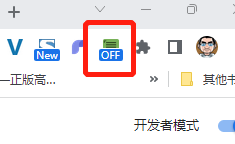
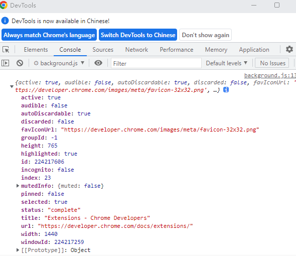

## 案例：聚焦模式

通过单击扩展工具栏图标或快捷键来简化当前页面的样式，使其更易于阅读。

### 构建扩展

首先，创建一个名为`focus-mode`保存扩展文件的新目录。如果您愿意，可以从[GitHub](https://github.com/justinzm/chrome-extensions-learning/tree/main/03_focus_mode)下载完整的源代码。

#### 第一步 添加有关扩展的信息和图标

创建一个名为`manifest.json`并包含以下代码的文件。

```
{
  "manifest_version": 3,
  "name": "聚焦模式",
  "description": "使新浪新闻页面更加聚焦新闻内容",
  "version": "1.0",
  "icons": {
    "16": "images/icon-16.png",
    "32": "images/icon-32.png",
    "48": "images/icon-48.png",
    "128": "images/icon-128.png"
  }
}
```

#### 第 2 步：初始化扩展

**background**：是一个常驻的页面，它的生命周期是插件中所有类型页面中最长的，它随着浏览器的打开而打开，随着浏览器的关闭而关闭，所以通常把需要一直运行的、启动就运行的、全局的代码放在background里面。

background的权限非常高，几乎可以调用所有的Chrome扩展API（除了devtools），而且它可以无限制跨域，也就是可以跨域访问任何网站而无需要求对方设置`CORS`。

扩展可以使用扩展的 service worker在后台监控浏览器事件。Service workers是特殊的 JavaScript 环境，它们被加载以处理事件并在不再需要时终止。

首先在`manifest.json`文件中注册service worker：

```
{
  ...
  "background": {
    "service_worker": "background.js"
  },
  ...
}
```

创建一个名为的文件`background.js`并添加以下代码：

```
chrome.runtime.onInstalled.addListener(() => {
  chrome.action.setBadgeText({
    text: "OFF",
  });
});
```

我们的 service worker 将监听的第一个事件是`runtime.onInstalled()`. 此方法允许扩展首次安装扩展程序、扩展程序更新到新版本以及 Chrome 更新到新版本时触发。

扩展可以使用Storage API和IndexedDB来存储应用程序状态。但是，在现在这个案例情况下，由于我们只处理两种状态，我们将使用**action's badge**文本本身来跟踪扩展是“开”还是“关”。

```
chrome.action.setBadgeText({
    text: "OFF",
});
```

设置图标下方显示内容，注意：空间有限，通常应使用四个或更少的字符。



#### 第3步：启用扩展操作

扩展操作控制扩展的工具栏图标。因此，每当用户单击扩展操作时，它要么运行一些代码（如本例所示），要么显示一个弹出窗口。添加以下代码以在`manifest.json`文件中声明扩展操作：

```
{
  ...
  "action": {
    "default_icon": {
      "16": "images/icon-16.png",
      "32": "images/icon-32.png",
      "48": "images/icon-48.png",
      "128": "images/icon-128.png"
    }
  },
  ...
}
```

##### 使用activeTab权限保护用户隐私

该`activeTab`权限授予扩展在当前活动选项卡上执行代码的临时能力。它还允许访问当前选项卡的敏感属性。

此权限在用户**调用invokes**扩展程序时启用。在这种情况下，用户通过单击扩展操作来调用扩展。

要使用`activeTab`权限，请将其添加到清单的权限数组中：

```json
{
  ...
  "permissions": ["activeTab"],
  ...
}
```

#### 第 4 步：跟踪当前选项卡的状态

用户单击扩展操作后，扩展将检查 URL 是否与文档页面匹配，使用startsWith方法。

接下来，它将检查当前选项卡的状态并设置下一个状态。将以下代码添加到`background.js`：

```js
const extensions = 'https://news.sina.com.cn/';

chrome.action.onClicked.addListener(async (tab) => {
  if (tab.url.startsWith(extensions)) {
    // Retrieve the action badge to check if the extension is 'ON' or 'OFF'
    const prevState = await chrome.action.getBadgeText({ tabId: tab.id });
    // Next state will always be the opposite
    const nextState = prevState === 'ON' ? 'OFF' : 'ON'

    // 设置图标（badge）下一个状态
    await chrome.action.setBadgeText({
      tabId: tab.id,
      text: nextState,
    });
...
```

**tab.url** 获取当前页面的相关信息



#### 第 5 步：添加或删除样式表

现在是时候改变页面的布局了。创建一个名为`focus_mode.css`并包含以下代码的文件：

```
body > .main-content > .top-banner,
body > .main-content > .article-content > .article-content-left > .top-ad,
body > .main-content > .article-content > .article-content-left > .blk-comment,
body > .main-content > .article-content > .article-content-left > .blk-related,
body > .main-content > .article-content > .article-content-right{
  display: none;
}
```

让我们使用Scripting API插入或删除样式表。首先`"scripting"`在清单中声明权限：

```
{
  ...
  "permissions": ["activeTab", "scripting"],
  ...
}
```

最后，在`background.js`添加以下代码来更改页面的布局：

```
  ...
    if (nextState === "ON") {
      // Insert the CSS file when the user turns the extension on
      await chrome.scripting.insertCSS({
        files: ["focus_mode.css"],
        target: { tabId: tab.id },
      });
    } else if (nextState === "OFF") {
      // Remove the CSS file when the user turns the extension off
      await chrome.scripting.removeCSS({
        files: ["focus_mode.css"],
        target: { tabId: tab.id },
      });
    }
  }
});
```

#### 第6步：分配键盘快捷键

只是为了好玩，让我们添加一个快捷方式，以便更轻松地启用或禁用焦点模式。将`"commands"`密钥添加到清单中。

```
  "commands": {
    "_execute_action": {
      "suggested_key": {
        "default": "Ctrl+Z",
        "mac": "Command+Z"
      }
    }
  }
}
```

对焦模式扩展关闭时：


对焦模式扩展开启时：


