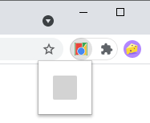

## Chrome 扩展的组件和结构

扩展是 HTML、CSS、JavaScript、图像和 Web 平台中使用的其他文件的压缩包。扩展程序可以修改用户看到并与之交互的 Web 内容。它们还可以扩展和更改浏览器本身的行为。

本页简要介绍了可能构成扩展一部分的文件、如何访问这些文件、如何使用 Chrome API、扩展文件如何通信以及如何存储数据。

### 架构

扩展的架构将取决于其功能，但所有扩展都必须有一个manifest。以下是扩展可以包括的其他组件：

- Service worker
- 工具栏图标
- 用户界面元素
- Content script
- 选项页面

#### manifest

清单文件`manifest.json`向浏览器提供有关扩展的信息，例如最重要的文件和扩展可能使用的功能。

```json
{
  "name": "My Extension",
  "description": "A nice little demo extension.",
  "version": "2.1",
  "manifest_version": 3,
  "icons": {
    "16": "icon_16.png",
    "48": "icon_48.png",
    "128": "icon_128.png"
  },
  "background": {
    "service_worker": "background.js"
  },
  "permissions": ["storage"],
  "host_permissions": ["*://*.example.com/*"],
  "action": {
    "default_icon": "icon_16.png",
    "default_popup": "popup.html"
  }
}
```

#### Service Worker

Service Worker是扩展的事件处理程序；它包含对扩展很重要的浏览器事件的侦听器。它处于休眠状态，直到触发事件然后执行指示的逻辑；它仅在需要时加载并在空闲时卸载。Service Worker 可以访问所有Chrome API，只要它在`manifest.json`.

一个扩展只能有一个Service Worker。要导入更多代码，可以通过在 manifest 中指定来将 service worker 声明为ES Module。`"background"`的manifest里面的`"type": "module"`

后续课程详细介绍更多信息。

#### 工具栏图标

扩展程序必须有一个位于浏览器工具栏中的图标。工具栏图标允许轻松访问并使用户知道安装了哪些扩展。大多数用户将通过单击图标与使用弹出窗口的扩展进行交互



#### Service worker

service worker是扩展的事件处理程序；它包含对扩展很重要的浏览器事件的侦听器。它处于休眠状态，直到触发事件然后执行指示的逻辑；它仅在需要时加载，空闲时卸载。Service Worker 可以访问所有Chrome API，只要它在`manifest.json`里。

一个扩展只能有一个 service worker。要导入更多代码，可以通过在清单中指定将service worker声明为ES 模块。``"background"` `"type": "module"`

#### Content scripts

Content scripts 允许扩展将逻辑注入页面，以便读取和修改其内容。Content scripts 包含在已加载到浏览器的页面上下文中执行的 JavaScript。

Content scripts 可以通过使用存储 API交换消息和存储值来与其父扩展通信。


#### 界面元素

以下是最常见的 UI 示例列表：

- 点击动作事件 An action click event.
- 弹出窗口 A popup.
- 上下文菜单 A context menu.
- 多功能框 An omnibox.
- 键盘快捷键 A keyboard shortcut.
- 桌面通知 Desktop notifications.
- 文字转语音 Text-to-speech.
- 注入页面的自定义 UI  A custom UI injected into a page.

#### 选项页面

正如扩展程序允许用户自定义 Chrome 浏览器一样，选项页面允许对扩展程序进行自定义。选项可用于启用功能并允许用户选择与其需求相关的功能。

用户可以通过直接链接或在扩展工具栏的上下文菜单中访问选项页面。

####  额外的 HTML 文件

扩展还可以包含其他未在清单中声明的 HTML 文件。所有扩展 HTML 文件都可以访问Chrome API，可以使用包括 Javascript 文件在内的脚本标签，但不能声明内联 JavaScript。

您可以使用网络 API window.open()、Chrome API windows.create()或tabs.create()打开这些页面。

### 扩展文件

####  引用扩展文件

正如网络上的 HTML 页面可以包含同一站点上具有*相对 URL*的文件一样，**扩展页面**也可以使用相对路径引用扩展资产。

```

```

要从**Content scripts **访问扩展文件，您可以调用[`chrome.runtime.getURL()`](https://developer.chrome.com/docs/extensions/reference/runtime#method-getURL)以获取扩展资产的*绝对 URL*。

```
let image = chrome.runtime.getURL("images/my_image.png")
```

要从**网站**访问扩展文件，您必须按如下方式构建 URL：

```text
chrome-extension://EXTENSION_ID/RELATIVE_PATH
```

您可以`EXTENSION_ID`在扩展程序管理页面**chrome://extensions**中找到。`RELATIVE_PATH`是相对于扩展顶级文件夹的文件路径。

#### 网络访问资源

Web 可访问资源是扩展内的文件（图像、HTML、CSS、Javascript），可以通过内容脚本、网页或其他扩展访问。

您可以声明公开了哪些资源以及清单中的来源：

```json
{
  ...
  "web_accessible_resources": [
    {
      "resources": [ "images/*.png" ],
      "matches": [ "https://example.com/*" ]
    }
  ],
  ...
}
```

###  使用 Chrome API

除了可以访问与网页相同的Web AP之外，扩展还可以使用与浏览器紧密集成的特定于扩展的 API 。例如，扩展程序和网页都可以访问打开 URL 的标准方法，但是扩展程序可以使用chrome.tabs.create() `window.open()`来指定应该在哪个窗口中显示该 URL 。

#### 异步方法

大多数 Chrome API 方法都是异步的；他们立即返回，无需等待操作完成。如果扩展需要知道异步操作的结果，有两种选择：

- 使用返回的承诺。
- 将回调函数传递到方法中。

请注意，这些选择是相互排斥的。如果将回调传递给方法，则不会返回任何承诺。如果您使用返回的承诺，请不要传递回调。

通常，您应该更喜欢承诺而不是回调。并非扩展 API 中的所有方法都支持承诺，但较新的方法支持。您可以通过检查其 API 参考页面来验证方法是否支持承诺。如果您需要为同一功能同时支持承诺和回调（因为您的用户使用较旧的浏览器），您可以使用`typeof`和可选链接测试该方法是否返回承诺。例如：

```js
typeof chrome.contextMenus.removeAll()?.then()
```

##### 承诺

支持两种处理承诺的方法。请参阅使用承诺以了解更多信息。

```js
// Promise
chrome.tabs.query(queryOptions)
.then((tabs) => {
  chrome.tabs.update(tabs[0].id, {url: newUrl});
  someOtherFunction();
});

// async-await
async function queryTab() {
  let tabs = await chrome.tabs.query(queryOptions);
  chrome.tabs.update(tabs[0].id, {url: newUrl});
  someOtherFunction();
}
```

##### 回调

当回调参数在其签名中可用时，方法是异步的。

```js
// Signatures for an asynchronous method
chrome.tabs.query(object queryInfo, function callback)
```

### 页面之间的通信

扩展中的不同组件可以使用消息传递相互通信。任何一方都可以侦听从另一端发送的消息，并在同一通道上做出响应。

### 保存数据

chrome 存储 API 已经过优化以满足扩展程序的特定存储需求。例如，无论何时更新数据，您都可以使用`onChanged()`事件来跟踪这些更改。所有扩展组件都可以访问此 API。扩展还可以使用 Web API indexedDB存储数据。

### 隐身模式

扩展程序不会在隐身窗口中运行，除非用户在扩展程序的设置页面中手动允许它。默认情况下，普通窗口和隐身窗口在单个共享进程中运行。但是，扩展程序可以在自己的单独进程中运行隐身窗口，或者根本不支持隐身窗口。您可以在清单中的“incognito”键中指定此行为。
