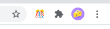
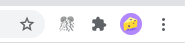

## API chrome.action

Chrome 为扩展程序提供了许多特殊用途的 API，例如`chrome.alarms`和`chrome.action`. 许多 API 由命名空间及其相关的清单字段组成。这些字段通常是权限，但并非都是如此。

使用`chrome.action`API 控制 Google Chrome 工具栏中的扩展程序图标。

> 必须在**manifest**中声明以下键才能使用此 API。**action**

您可以使用`chrome.action`API 来控制 Chrome 用户界面中扩展程序的工具栏按钮。操作图标显示在浏览器工具栏中，在多功能框的右侧。安装后，默认情况下，这些会出现在扩展菜单中。用户可以选择将您的扩展程序图标固定到工具栏。

请注意，即使`action`未指定密钥，每个扩展程序在 Chrome 的工具栏中都会有一个图标。

###  Manifest

为了使用`chrome.action`API，您需要指定一个`"manifest_version"`of`3`或更高级别，并将`action`包含在您的manifest中。

```json
{
  "name": "Action Extension",
  ...
  "action": {
    "default_icon": {              // optional
      "16": "images/icon16.png",   // optional
      "24": "images/icon24.png",   // optional
      "32": "images/icon32.png"    // optional
    },
    "default_title": "Click Me",   // optional, shown in tooltip
    "default_popup": "popup.html"  // optional
  },
  ...
}
```

这些值中的每一个都是可选的；技术上允许使用空字典。

### 界面图标

该图标是工具栏按钮中使用的主要图像。图标的宽度和高度均为 16 DIP。该图标最初由文件条目中的`default_icon`键设置。键是图标大小，值是图标地址。Chrome 将使用这些图标来选择要使用的图像比例。如果未找到完全匹配项，Chrome 将选择最接近的可用项并将其缩放以适合图像。

也可以使用该`action.setIcon()`方法以编程方式设置图标。这可用于指定不同的图像路径或使用[HTML 画布元素HTMLCanvasElement](https://developer.mozilla.org/docs/Web/API/HTMLCanvasElement)提供动态生成的图标

```
const canvas = new OffscreenCanvas(16, 16);
const context = canvas.getContext('2d');
context.clearRect(0, 0, 16, 16);
context.fillStyle = '#00FF00';  // Green
context.fillRect(0, 0, 16, 16);
const imageData = context.getImageData(0, 0, 16, 16);
chrome.action.setIcon({imageData: imageData}, () => { /* ... */ });
```

### 扩展提示（标题）

当用户将鼠标悬停在工具栏中扩展程序的图标上时，会出现扩展提示或标题。当按钮获得焦点时，它也包含在屏幕阅读器所说的可访问文本中。

默认工具提示是从中对象的`default_title`字段设置的。您还可以使用该方法以编程方式设置它。`action``manifest.json``action.setTitle()`

### 徽章

Actions 可以选择显示一个“徽章”——一些文字叠加在图标上。这使得更新操作以显示有关扩展状态的少量信息（例如计数器）变得容易。徽章有一个文本组件和一个背景颜色。

> 请注意，徽章的空间有限，通常应使用四个或更少的字符。

徽章不能从manifest中获取的默认值；可以使用和以编程方式设置它`action.setBadgeText()`、`action.setBadgeBackgroundColor()`。设置颜色时，值可以是构成徽章 RGBA 颜色的 0 到 255 之间的四个整数组成的数组，也可以是具有CSS 颜色值的字符串。

```
chrome.action.setBadgeBackgroundColor(
  {color: [0, 255, 0, 0]},  // Green
  () => { /* ... */ },
);

chrome.action.setBadgeBackgroundColor(
  {color: '#00FF00'},  // Also green
  () => { /* ... */ },
);

chrome.action.setBadgeBackgroundColor(
  {color: 'green'},  // Also, also green
  () => { /* ... */ },
);
```

###  Popup

当用户单击工具栏中扩展的操作按钮时，将显示操作的弹出窗口。弹出窗口可以包含您喜欢的任何 HTML 内容，并且会自动调整大小以适合其内容。弹出窗口不能小于 25x25，也不能大于 800x600。

弹出窗口最初是根据文件中键的`default_popup`属性设置的。如果存在，这应该指向扩展目录中的相对路径。它也可以使用该方法动态更新以指向不同的相对路径。`action``manifest.json``action.setPopup()`

> `action.onClicked`如果扩展操作指定了在单击当前选项卡时显示的弹出窗口，则不会调度该事件。

### 选项卡状态

每个选项卡的扩展操作可以有不同的状态。例如，您可以将每个选项卡上的徽章文本设置为不同（以显示特定于选项卡的状态）。您可以使用API`tabId`上各种设置方法中的属性来设置单个选项卡的值。`action`例如，要在特定选项卡上设置徽章文本，您可以执行以下操作：

```js
function getTabId() { /* ... */}
function getTabBadge() { /* ... */}

chrome.action.setBadgeText(
  {
    text: getTabBadge(tabId),
    tabId: getTabId(),
  },
  () => { ... }
);
```

### 启用状态

默认情况下，每个选项卡上都启用（可单击）工具栏操作。您可以使用`action.enable()`和`action.disable()`方法来控制它。这只会影响是否将弹出窗口（如果有）或`action.onClicked`事件发送到您的扩展；它不会影响操作在工具栏中的存在。

### 类型

#### OpenPopupOptions 打开弹出选项

windowId  窗口编号

打开操作弹出窗口的 ID。如果未指定，则默认为当前活动的窗口。

#### TabDetails 标签详情

tabId  标签ID

查询状态的选项卡的 ID。如果未指定选项卡，则返回非选项卡特定状态。

#### UserSettings 用户指定设置

isOnToolbar 布尔值

扩展的操作图标是否在浏览器窗口的顶级工具栏上可见（即，扩展是否已被用户“固定”）。

### 方法

#### disable 禁止

```
chrome.action.disable(
  tabId?: number,
  callback?: function,
)
```

禁用选项卡的操作

- tabId number 可选  要修改操作的选项卡的 ID；
- callback  function 可选  `callback`参数 `() => void`

#### enable 启用

```
chrome.action.enable(
  tabId?: number,
  callback?: function,
)
```

启用选项卡的操作

- tabId number 可选  要修改操作的选项卡的 ID；
- callback  function 可选  `callback`参数 `() => void`

#### getBadgeBackgroundColor 获取徽章背景颜色

```
chrome.action.getBadgeBackgroundColor(
  details: TabDetails,
  callback?: function,
)
```

#### getBadgeText 获取徽章文本

```
chrome.action.getBadgeText(
  details: TabDetails,
  callback?: function,
)
```

获取操作的徽章文本。如果未指定选项卡，则返回非选项卡特定的徽章文本。

#### getPopup 获取弹出窗口

```
chrome.action.getPopup(
  details: TabDetails,
  callback?: function,
)
```

#### getTitle 获取标题

```
chrome.action.getTitle(
  details: TabDetails,
  callback?: function,
)
```

#### getUserSettings 获取用户设置

```
chrome.action.getUserSettings(
  callback?: function,
)
```

#### isEnabled 启用

```
chrome.action.isEnabled(
  tabId?: number,
  callback?: function,
)
```

#### openPopup 打开弹窗

```
chrome.action.openPopup(
  options?: OpenPopupOptions,
  callback?: function,
)
```

#### setBadgeBackgroundColor 设置徽章背景颜色

```
chrome.action.setBadgeBackgroundColor(
  details: object,
  callback?: function,
)
```

object: 

- tabId: 将更改限制为选择特定选项卡时。选项卡关闭时自动重置。
- color: 由 [0,255] 范围内的四个整数组成的数组，构成徽章的 RGBA 颜色。例如，不透明的红色是`[255, 0, 0, 255]`。也可以是带有 CSS 值的字符串，不透明的红色为`#FF0000`或`#F00`。

#### setBadgeText 设置徽章文本

```
chrome.action.setBadgeText(
  details: object,
  callback?: function,
)
```

object: 

- tabId: 将更改限制为选择特定选项卡时。选项卡关闭时自动重置。
- text: 可以传递任意数量的字符，但只能容纳大约四个字符。

#### setIcon 设置图标

```
chrome.action.setIcon(
  details: object,
  callback?: function,
)
```

设置操作的图标。图标可以指定为图像文件的路径或来自画布元素的像素数据，或指定为其中任何一个的字典。必须指定**路径**或**imageData**属性。

object: 

- tabId: 将更改限制为选择特定选项卡时。选项卡关闭时自动重置。
- path: 指向要设置的图标的相对图像路径或字典 {size -> relative image path}。如果图标被指定为字典，则根据屏幕的像素密度选择要使用的实际图像。如果适合一个屏幕空间单位的图像像素数等于`scale`，则将`scale`选择大小为 * n 的图像，其中 n 是 UI 中图标的大小。必须至少指定一张图片。请注意，'details.path = foo' 等同于 'details.path = {'16': foo}'
- imageData: 对象或字典 {size -> ImageData} 表示要设置的图标。如果图标被指定为字典，则根据屏幕的像素密度选择要使用的实际图像。如果适合一个屏幕空间单位的图像像素数等于`scale`，则将`scale`选择大小为 * n 的图像，其中 n 是 UI 中图标的大小。必须至少指定一张图片。请注意，'details.imageData = foo' 等同于 'details.imageData = {'16': foo}'

#### setPopup 设置弹窗

```
chrome.action.setPopup(
  details: object,
  callback?: function,
)
```

将 HTML 文档设置为在用户单击操作图标时作为弹出窗口打开。

object: 

- tabId: 将更改限制为选择特定选项卡时。选项卡关闭时自动重置。
- popup: 要在弹出窗口中显示的 HTML 文件的相对路径。如果设置为空字符串 ( `''`)，则不显示弹出窗口。

#### 设置标题

```
chrome.action.setTitle(
  details: object,
  callback?: function,
)
```

设置动作的标题。这显示在工具提示中。

object: 

- tabId: 将更改限制为选择特定选项卡时。选项卡关闭时自动重置。
- title: 鼠标悬停时操作应显示的字符串。

### 事件

#### 点击

```
chrome.action.onClicked.addListener(
  callback: function,
)
```

### 案例

#### 显示弹出窗口

当用户单击扩展程序的操作时，扩展程序通常会显示一个弹出窗口。要在您自己的扩展中实现这一点，请在您的扩展中声明弹出窗口`manifest.json`并点击 Chrome 扩展应该在弹出窗口中显示的内容。

```
// manifest.json
{
    "name": "Action API Demo",
    "version": "1.0",
    "manifest_version": 3,
    "background": {
      "service_worker": "background.js"
    },
    "action": {
      "default_title": "Default Title",
      "default_popup": "popups/popup.html",
      "default_icon": {
        "32": "icons/32.png",
        "72": "icons/72.png",
        "128": "icons/128.png",
        "512": "icons/512.png"
      }
    },
    "icons": {
      "32": "icons/32.png",
      "72": "icons/72.png",
      "128": "icons/128.png",
      "512": "icons/512.png"
    }
}
```

```
<!-- popup.html -->
<!DOCTYPE html>
<html lang="en">
<head>
  <meta charset="UTF-8">
  <meta http-equiv="X-UA-Compatible" content="IE=edge">
  <meta name="viewport" content="width=device-width, initial-scale=1.0">
  <title>Document</title>
  <style>
    .center {
      min-height: 100px;
      min-width: 200px;
      display: grid;
      flex-direction: column;
      align-items: center;
      justify-content: center;
      gap: 1ch;
      background-color: lightseagreen;
    }
    .text {
      font-size: 2rem;
      font-weight: bold;
      color: white;
    }
  </style>
</head>
<body>
  <h2>Action API Demo</h2>
  <div class="center">
    <span class="text">Hello, world!</span>
  </div>
</body>
</html>
```

#### 显示演示页面 background.js 

扩展安装后在浏览器中打开显示demo/index.html演示页面

```
// 一旦扩展安装后显示演示页面
chrome.runtime.onInstalled.addListener((_reason) => {
    chrome.tabs.create({
      url: 'demo/index.html'
    });
});

```


#### 演示功能

##### enable / disable

启用或禁用Chrome工具中的扩展按钮。当禁用时，单击该动作将不会打开弹出窗口或触发 `action.onClicked` 事件





```
let actionEnabled = true;
document.getElementById('toggle-state-button').addEventListener('click', (_event) => {
  if (actionEnabled) {
    chrome.action.disable();
  } else {
    chrome.action.enable();
  }
  actionEnabled = !actionEnabled;
});
```

##### Popup

manifest.json 将action.default_popup的值设置为popups/popup.html。我们可以在运行时使用 action.setPopup 进行修改popup地址

```
<label>
	选择popup页面<br>
    <select id="popup-options">
        <option value="/popups/popup.html">Hello world (default)</option>
        <option value="/popups/a.html">A</option>
        <option value="/popups/b.html">B</option>
        <option value="">onClicked handler</option>
    </select>
</label>

<div class="spaced">
    <label>
        当前popup的值
        <input type="text" id="current-popup-value" disabled>
    </label>
</div>
```

```
document.getElementById('popup-options').addEventListener('change', async (event) => {
  let popup = event.target.value;
  await chrome.action.setPopup({ popup });

  // 显示更新后的popup路径
  await getCurrentPopup();
});

async function getCurrentPopup() {
  let popup = await chrome.action.getPopup({});
  document.getElementById('current-popup-value').value = popup;
  return popup;
};
```

##### Badge 徽章文本

```
<section id="badge-text">
    <h2>Badge Text</h2>

    <p>The action's badge text is a text overlay with a solid background color. This provides a
    passive UI surface to share information with the user. It is most commonly used to show a
    notification count or number of actions taken on the current page.</p>

    <div class="spaced">
        <label>
            Enter badge text (live update)<br>
            <input type="text" id="badge-text-input">
        </label>
    </div>

    <div class="flex">
        <label class="full-width">
            Current badge text
            <input type="text" id="current-badge-text" disabled>
        </label>
        <button id="clear-badge-button">clear badge text</button>
    </div>

    <div class="spaced">
    	<button id="set-badge-background-color-button">Randomize badge background color</button>
    </div>

    <div class="flex">
        <label class="full-width">
        	Current badge color
        	<input type="text" id="current-badge-bg-color" disabled>
        </label>
        <button id="reset-badge-background-color-button">reset badge color</button>
    </div>
</section>
```

```
document.getElementById('badge-text-input').addEventListener('input', async (event) => {
  let text = event.target.value;
  await chrome.action.setBadgeText({ text });

  showBadgeText();
});

document.getElementById('clear-badge-button').addEventListener('click', async () => {
  await chrome.action.setBadgeText({ text: '' });

  showBadgeText();
});

async function showBadgeText() {
  let text = await chrome.action.getBadgeText({});
  document.getElementById('current-badge-text').value = text;
}

```

##### Badge 徽章文本背景

```
<div class="spaced">
	<button id="set-badge-background-color-button">Randomize badge background color</button>
</div>

<div class="flex">
    <label class="full-width">
        Current badge color
        <input type="text" id="current-badge-bg-color" disabled>
    </label>
    <button id="reset-badge-background-color-button">reset badge color</button>
</div>
```

```
document.getElementById('set-badge-background-color-button').addEventListener('click', async () => {
  // To show off this method, we must first make sure the badge has text
  let currentText = await chrome.action.getBadgeText({});
  if (!currentText) {
    chrome.action.setBadgeText({ text: 'hi :)' });
    showBadgeText();
  }

  // Next, generate a random RGBA color
  let color = [0, 0, 0].map(() => Math.floor(Math.random() * 255));

  // Use the default background color ~10% of the time.
  //
  // NOTE: Alpha color cannot be set due to crbug.com/1184905. At the time of writing (Chrome 89),
  // an alpha value of 0 sets the default color while a value of 1-255 will make the RGB color
  // fully opaque.
  if (Math.random() < 0.1) {
    color.push(0);
  } else {
    color.push(255);
  }

  chrome.action.setBadgeBackgroundColor({ color });
  showBadgeColor();
});

async function showBadgeColor() {
  let color = await chrome.action.getBadgeBackgroundColor({});
  document.getElementById('current-badge-bg-color').value = JSON.stringify(color, null, 0);
}

document.getElementById('reset-badge-background-color-button').addEventListener('click', async () => {
  chrome.action.setBadgeBackgroundColor({ color: [0, 0, 0, 0] });
  showBadgeColor();
});
```

##### Icon 设置图标

该方法允许您通过提供图像路径或原始ImageData来更改操作按钮的图标。

```
<section id="setIcon">
    <h2>Icon</h2>
    <button id="set-icon-button">set a new action icon</button>
    <button id="reset-icon-button">reset action icon</button>
</section>
```

```
const EMOJI = [
  'confetti',
  'suit',
  'bow',
  'dog',
  'skull',
  'yoyo',
  'cat',
];

let lastIconIndex = 0;
document.getElementById('set-icon-button').addEventListener('click', async () => {
  // Clear out the badge text in order to make the icon change easier to see
  chrome.action.setBadgeText({ text: '' });

  // Randomly pick a new icon
  let index = lastIconIndex;
  index = Math.floor(Math.random() * (EMOJI.length));
  if (index === lastIconIndex) {
    // Dupe detected! Increment the index & modulo to make sure we don't go out of bounds
    index = (index + 1) % EMOJI.length;
  }
  let emojiFile = `images/emoji-${EMOJI[index]}.png`;
  lastIconIndex = index;

  // There are easier ways for a page to extract an image's imageData, but the approach used here
  // works in both extension pages and service workers.
  let response = await fetch(chrome.runtime.getURL(emojiFile));
  let blob = await response.blob();
  let imageBitmap = await createImageBitmap(blob);
  let osc = new OffscreenCanvas(imageBitmap.width, imageBitmap.height);
  let ctx = osc.getContext('2d');
  ctx.drawImage(imageBitmap, 0, 0);
  let imageData = ctx.getImageData(0, 0, osc.width, osc.height);

  chrome.action.setIcon({ imageData });
});

document.getElementById('reset-icon-button').addEventListener('click', () => {
  let manifest = chrome.runtime.getManifest();
  chrome.action.setIcon({ path: manifest.action.default_icon });
});
```

##### 修改扩展标题

```
<div class="spaced">
    <label>
        Enter a new title (debounced)<br>
        <input type="text" id="title-input">
    </label>
</div>

<div class="flex">
    <label class="full-width">
        Current title
        <input type="text" id="current-title" disabled>
    </label>
    <button id="reset-title-button">reset title</button>
</div>
```

```
let titleInput = document.getElementById('title-input');
let titleInputDebounce = Number.parseInt(titleInput.dataset.debounce || 100);
titleInput.addEventListener('input', debounce(200, async (event) => {
  let title = event.target.value;
  chrome.action.setTitle({ title });

  showActionTitle();
}));

document.getElementById('reset-title-button').addEventListener('click', async (event) => {
  let manifest = chrome.runtime.getManifest();
  let title = manifest.action.default_title;

  chrome.action.setTitle({ title });

  showActionTitle();
});

async function showActionTitle() {
  let title = await chrome.action.getTitle({});

  // If empty, the title falls back to the name of the extension
  if (title === '') {
    // … which we can get from the extension's manifest
    let manifest = chrome.runtime.getManifest();
    title = manifest.name;
  }

  document.getElementById('current-title').value = title;
}
```

